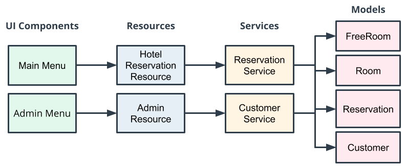

# Hotel Reservation Application

In this project, we have developed an enhanced Java-based hotel reservation application. This application enables customers to search and book hotel rooms according to room availability.

## Key Components of the Application

The primary components of the Hotel Reservation Application include:

1. **Command Line Interface (CLI):** We have utilized the CLI for user interaction, allowing users to input commands to search for available rooms, book rooms, and perform other actions.
2. **Java Code:** This component contains the business logic for the application.
3. **Java Collections:** Java collections are employed for in-memory data storage, such as user information and room availability.

## Application Architecture

The application architecture is divided into the following layers:

1. **User Interface (UI):** This layer includes a main menu for users who wish to book a room and an admin menu for managing administrative tasks.
2. **Resources:** These act as the Application Programming Interface (API) to our UI.
3. **Services:** The services layer communicates with resources and other services to build the necessary business logic for providing feedback to the UI.
4. **Data Models:** Data models are used to represent the domain within the system (e.g., rooms, reservations, and customers).

## Layered Architecture

One of the key features of this architecture is the use of layers to promote modularity and decoupling. 
For instance, if we later decide to switch the UI components from a command-line interface to a web-based interface, the layered architecture will facilitate this change. 
> A UI component should never communicate directly with a service, as this would expose the service implementation to the UI and make it challenging to replace later.

## Java Version

This application utilizes Java version 14.

## How to Run the Application

To run the application, simply compile the project and execute the HotelApplication class.

### Author Contact 
1. **Email:** kirkgo [at] gmail.com
2. **LinkedIn:** [https://www.linkedin.com/in/kirkgo/](https://www.linkedin.com/in/kirkgo/)
